# Enterprise Active Directory Lab

A Windows Server 2025 enterprise lab demonstrating Active Directory Domain Services, Group Policy, SMB file sharing, NTFS permissions, and role-based access control (RBAC).

## Project Overview

This project simulates a small enterprise Windows environment built with Windows Server 2025 and a Windows 11 domain-joined client. The lab provides centralized identity management through Active Directory, separates users and devices with Organizational Units (OUs), applies workstation security settings through Group Policy, and protects departmental SMB shares with security groups and NTFS permissions.

The environment was validated from the client side by confirming domain authentication, applied computer policies, authorized HR share access, and denied access for an unauthorized user.

## Objectives

- Deploy an Active Directory domain
- Design an enterprise OU structure
- Create departmental users and security groups
- Implement RBAC through group membership
- Configure departmental SMB shares
- Apply NTFS permissions to shared folders
- Create and link an enterprise workstation GPO
- Join a Windows 11 client to the domain
- Validate authentication, policy application, and resource access

## Lab Environment

| Component | Technology |
|---|---|
| Hypervisor | VMware Workstation |
| Domain Controller | Windows Server 2025 |
| Domain Controller Hostname | DC01 |
| Client | Windows 11 Enterprise |
| Client Hostname | CLIENT01 |
| Domain | corp.local |
| Directory Service | Active Directory Domain Services |
| Name Resolution | Windows DNS |
| Group Policy | Group Policy Management Console |
| File Sharing | SMB |
| Permissions | NTFS ACLs |
| Authentication | Active Directory |

## Architecture

```text
VMware Virtual Network
├── DC01 — Windows Server 2025
│   ├── Active Directory Domain Services
│   ├── DNS
│   ├── Group Policy
│   └── Departmental SMB shares
└── CLIENT01 — Windows 11 Enterprise
    ├── Joined to corp.local
    ├── Domain user authentication
    └── Group Policy and share-access validation
```

## Active Directory Design

The `corp.local` domain was organized into departmental and infrastructure OUs:

```text
corp.local
├── Finance
├── Groups
├── HelpDesk
├── HR
├── IT
├── Management
├── Sales
├── Servers
└── Workstations
```

Departmental security groups include `Finance_Users`, `HR_Users`, `IT_Admins`, `Management_Users`, and `Sales_Users`. Users receive access based on group membership rather than individual permissions.

### Domain authentication

CLIENT01 presents the CORP domain sign-in interface for domain users.

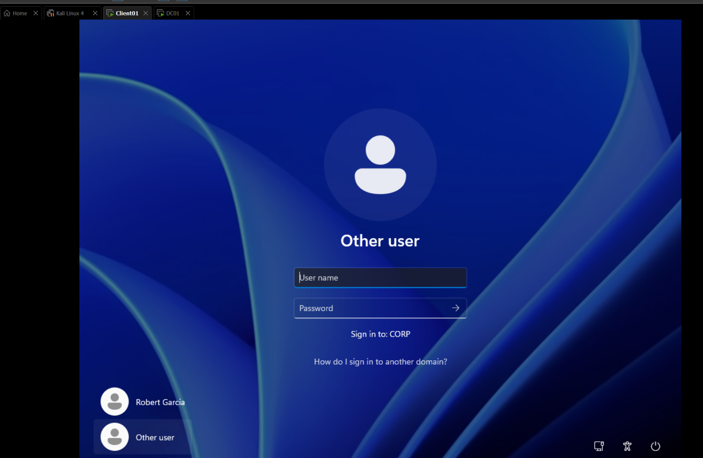

### Organizational Unit structure

The domain contains separate OUs for users, groups, servers, and workstations.

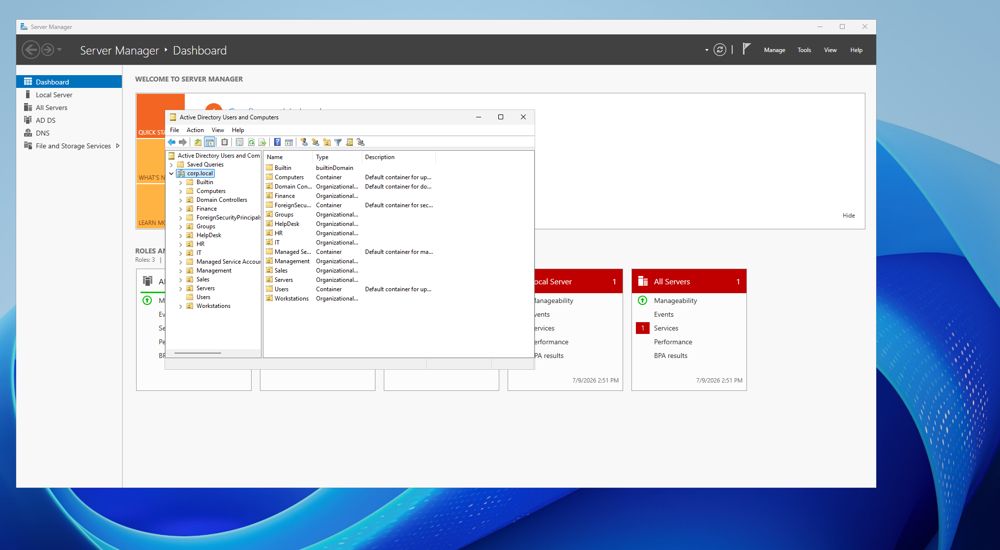

### Departmental users

HR domain accounts were created inside the HR OU.

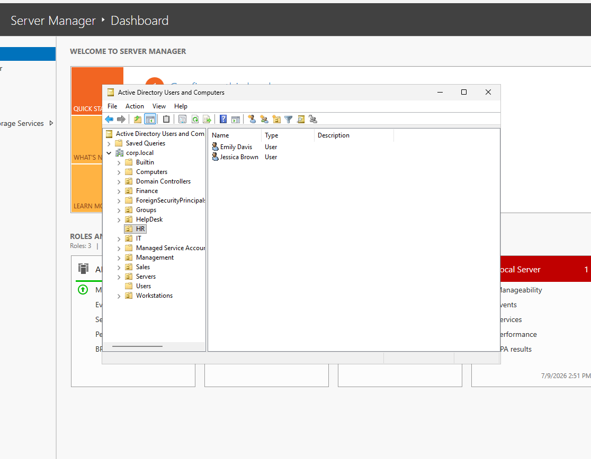

### Security groups and membership

Departmental security groups support role-based administration and resource access.

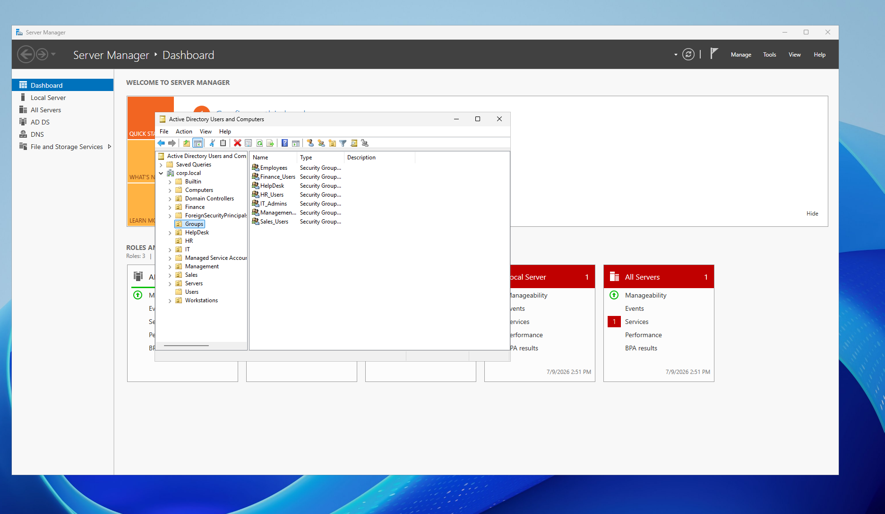

The Finance group membership demonstrates how users are assigned access through security groups.

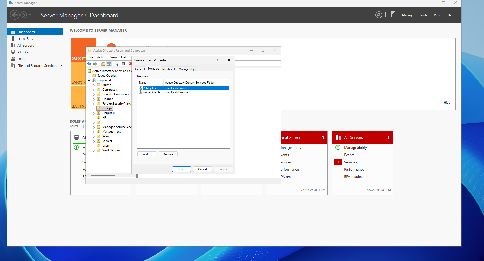

## File Services and RBAC

Departmental SMB shares were created for Finance, HR, IT, Management, and Sales.

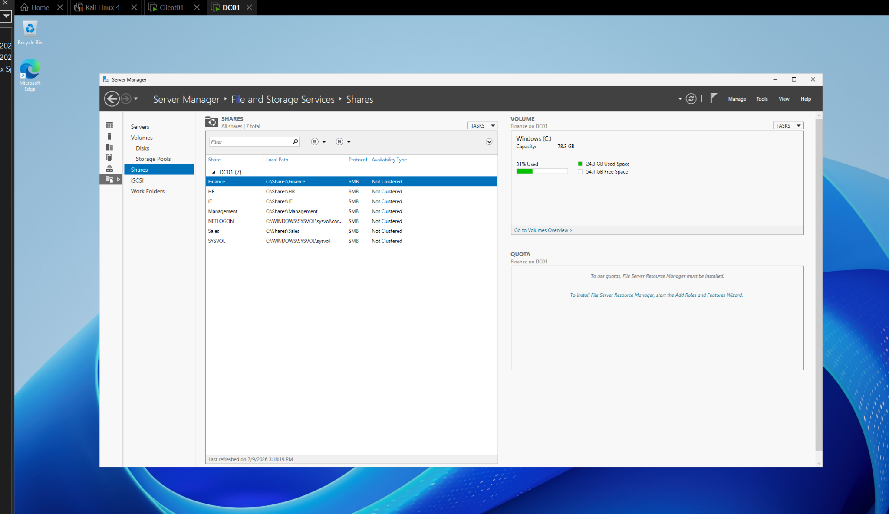

The shares are discoverable from the domain-joined Windows 11 client.

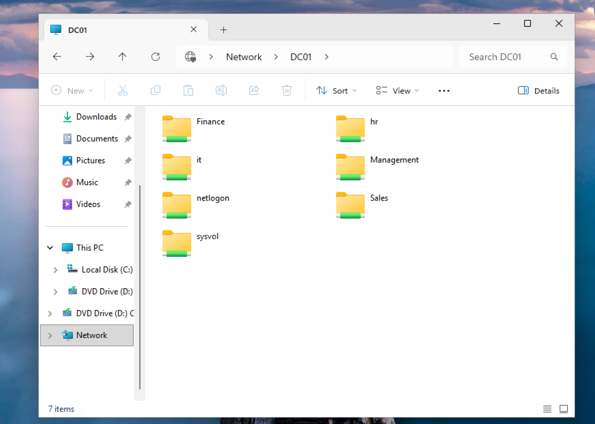

NTFS permissions grant the `HR_Users` group Modify, Read, Write, and folder traversal permissions on the HR share.

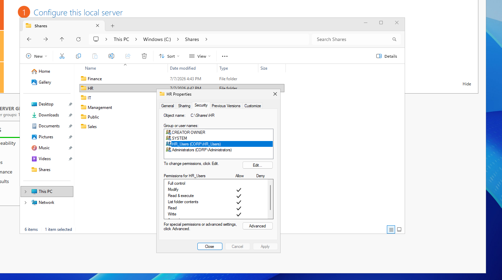

### Access-control validation

An unauthorized user is denied access to the HR share.

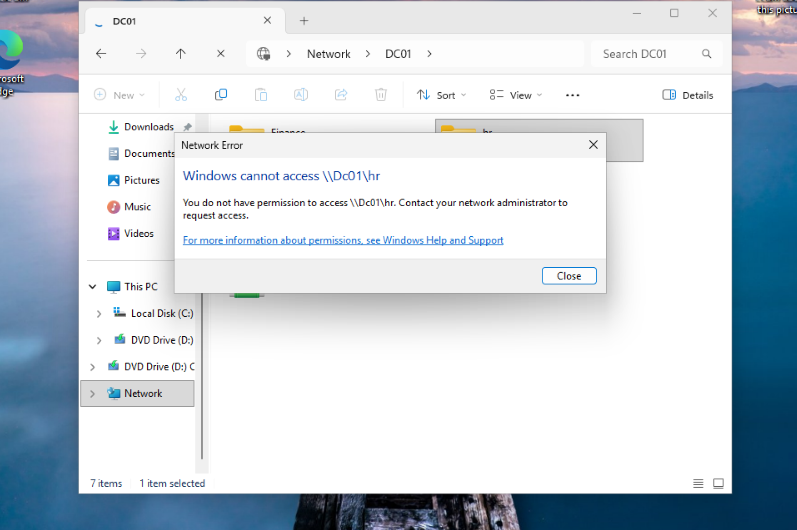

An authorized HR user can open `\\DC01\HR` successfully.

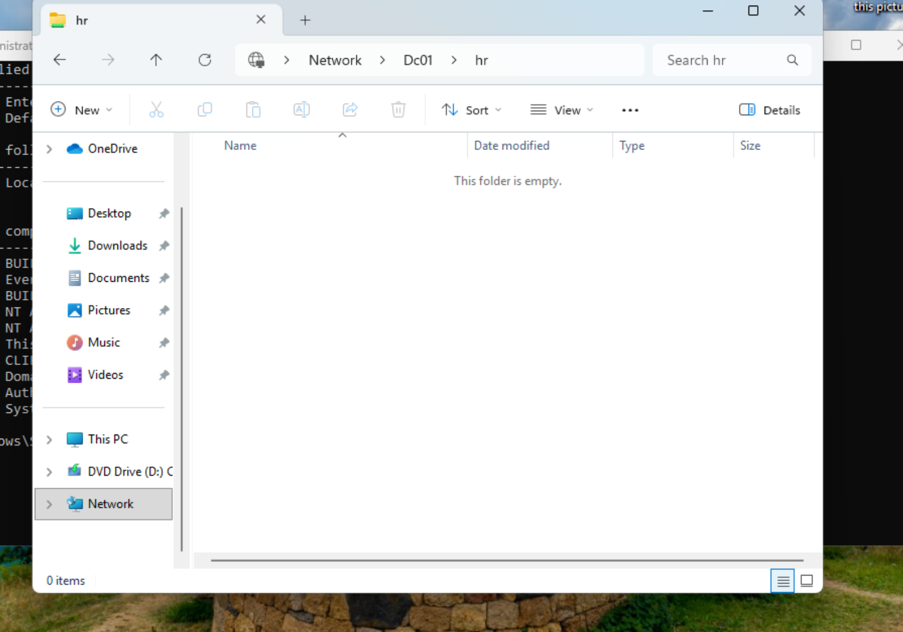

Together, these tests demonstrate departmental isolation and successful RBAC enforcement.

## Group Policy

The **Enterprise Workstation Policy** is linked to the Workstations OU and applies to authenticated domain computers.

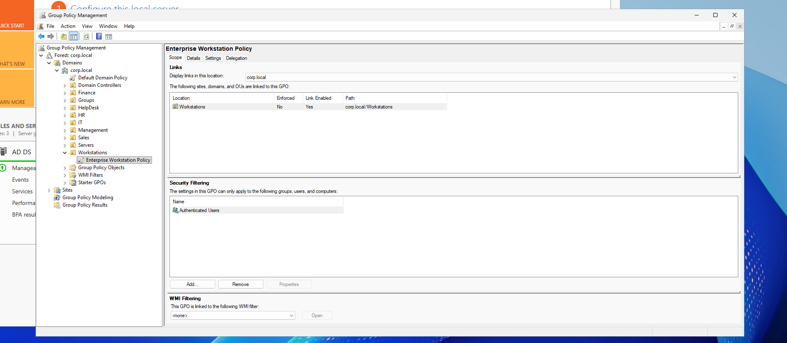

The policy deploys enterprise workstation settings, including a legal login banner.

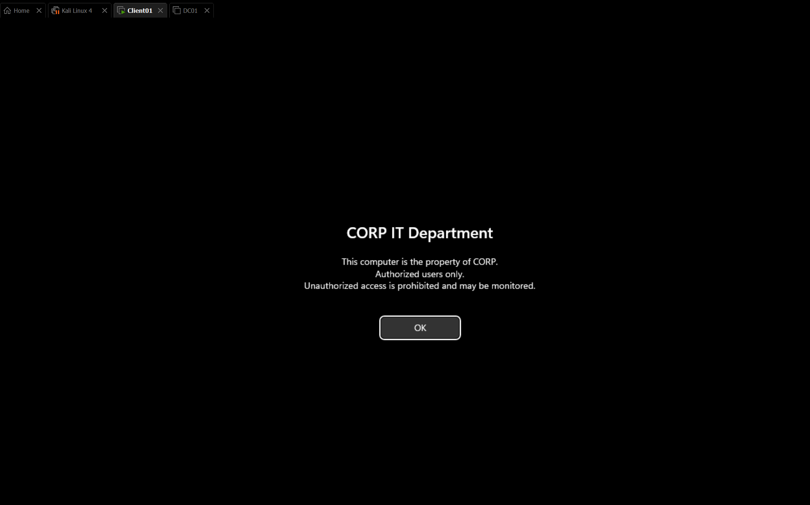

An elevated `gpresult /r /scope computer` validation confirms that CLIENT01 resides in the Workstations OU and successfully receives both the Enterprise Workstation Policy and Default Domain Policy from DC01.

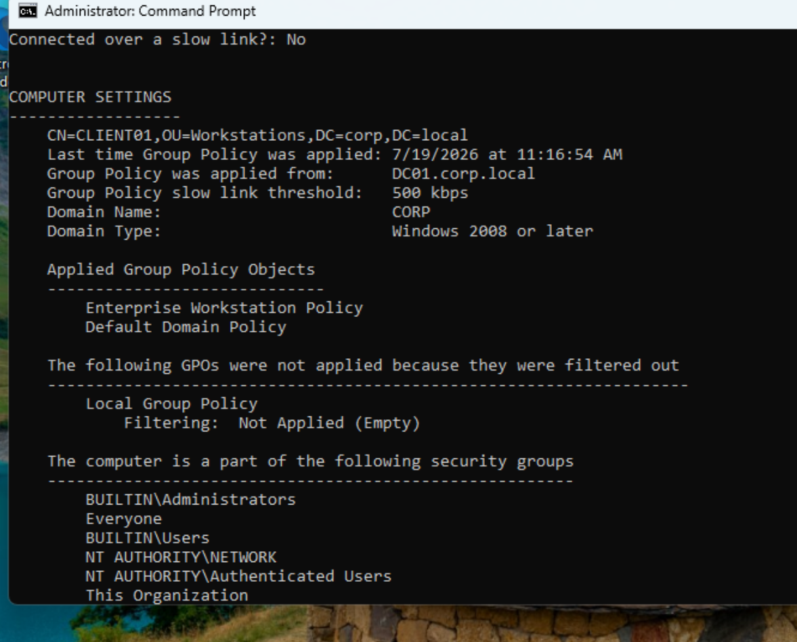

## Client Validation

Successful domain authentication was confirmed on CLIENT01 with an Active Directory user account.

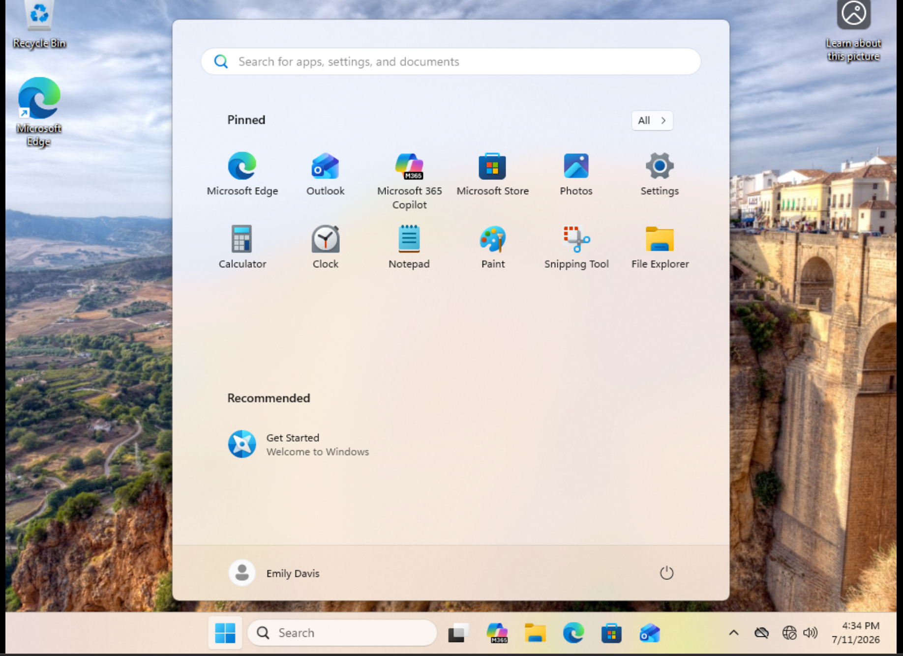

The completed validation confirms:

- CLIENT01 is joined to `corp.local`
- CLIENT01 is located in the Workstations OU
- Enterprise Workstation Policy applies successfully
- Domain users can authenticate on CLIENT01
- Authorized HR users can access the HR share
- Unauthorized users are denied access
- NTFS permissions and security-group membership enforce RBAC

## Skills Demonstrated

- Active Directory administration
- Windows Server 2025 administration
- Organizational Unit design
- User and security-group management
- Group Policy creation and deployment
- Windows DNS
- SMB file services
- NTFS permissions and ACLs
- Role-Based Access Control
- Windows client domain management
- Authentication and access-control testing
- Technical documentation

## What I Learned

This project provided hands-on experience deploying and managing a Windows enterprise environment. I configured centralized identity management with Active Directory, structured resources with OUs, implemented RBAC through departmental security groups, secured SMB shares with NTFS permissions, and deployed workstation settings through Group Policy. Client-side validation reinforced the importance of testing both successful and denied access, verifying computer placement in the correct OU, and confirming applied policies with `gpresult`.
